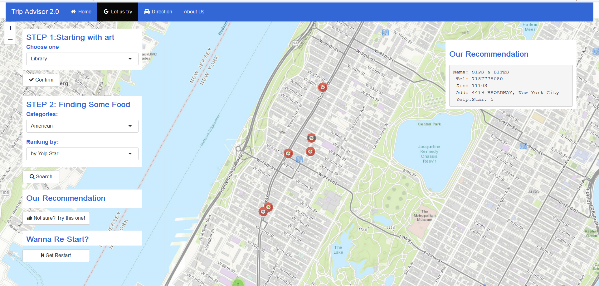

# Project 2: Shiny App Development Version 2.0

### [Project Description](doc/project2_desc.md)



In this second project of GR5243 Applied Data Science, we develop a version 2.0 of an *Exploratory Data Analysis and Visualization* shiny app as a trip advising tool using [NYC Open Data](https://opendata.cityofnewyork.us/)  website. See [Project 2 Description](doc/project2_desc.md) for more details.  


## Trip Advisor 2.0
Term: Fall 2018

+ Team #5
+ **Projec title**: Trip Advisor 2.0
	+ Jiansong Chen
	+ Yi Lin
	+ Yang Xing
	+ Zhibo Zhou
	
+ **Application access link**: Previous version: https://qianshi58.shinyapps.io/fall2017-proj2-grp5/

+ **Project summary**: The functionality of the application is to provide useful information for users when traveling in New York City based on their inputs of interest. Specifically, recommended restaurants are provided for users based on their selection of place to visit around New York City in different categories and a route map will be provided between the restaurant and the place.

+ **Contribution statement**: ([default](doc/a_note_on_contributions.md)) Jiansong Chen (JC), Yi Lin (YL), Yang Xing (YX) and Zhibo Zhou (ZZ) designed the appplication. Specifically, JC, YX and ZZ designed and improved main panel (UI and server); JC, YL and ZZ designed and improved navigation functionality; JC added new category of application data; YL and YX documented and wrote README file. All team members contributed to the GitHub repository and prepared the presentation. All team members approve our work presented in our GitHub repository including this contribution statement. 
	
Following [suggestions](http://nicercode.github.io/blog/2013-04-05-projects/) by [RICH FITZJOHN](http://nicercode.github.io/about/#Team) (@richfitz). This folder is orgarnized as follows.

```
proj/
├── app/
├── lib/
├── data/
├── doc/
└── output/
```

Please see each subfolder for a README file.

